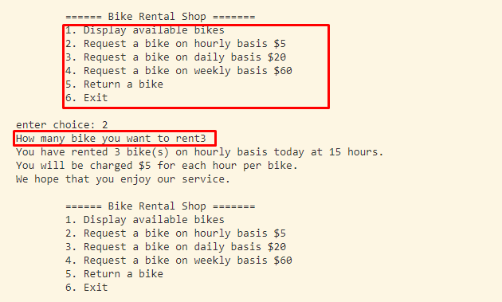

# Bike-Rental-System
#### Bike rental system implemented in Python using object oriented programming.

## Customers can
See available bikes on the shop 
Rent bikes on hourly basis $5 per hour. 
Rent bikes on daily basis $20 per day. 
Rent bikes on weekly basis $60 per week. 
Family Rental, a promotion that can include from 3 to 5 Rentals (of any type) with a discount of 30% of the total price

## The rental shops can
issue a bill when customer decides to return the bike. 
display available inventory 
take requests on hourly, daily and weekly basis by cross verifying stock 
Since classes are used various customers and bike rental shops can be instantiated as needed. 

For simplicity we assume that any customer requests rentals of only one type i.e hourly, monthly or weekly but is free to chose the number of bikes he/she wants. However requested bikes should be less than available stock.

### Run Project

